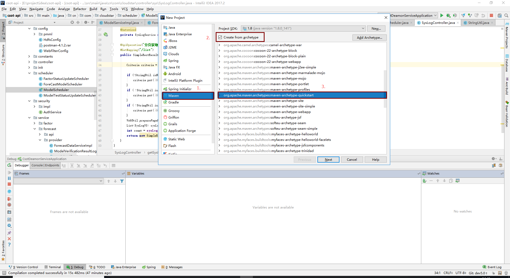
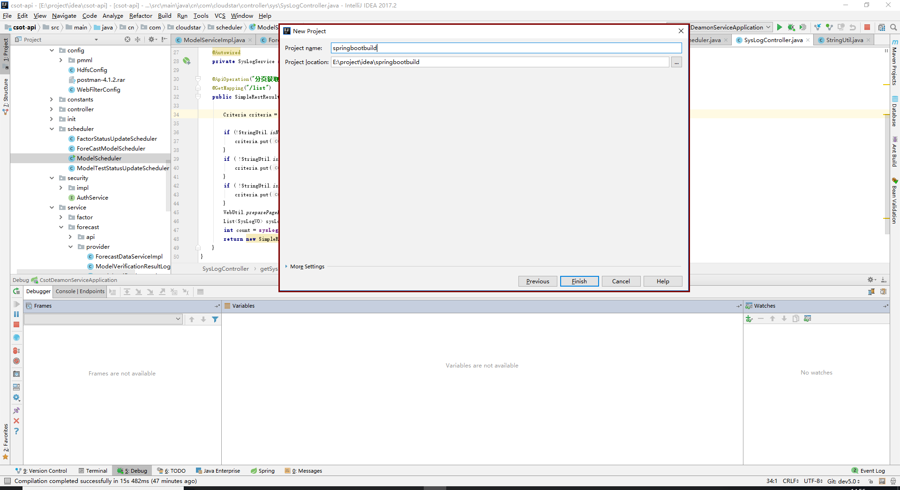

### 使用idea 快速搭建一个SpringBoot 项目

#### 创建一个Maven项目

- Eile-New-Project-Maven



- 点击next按钮,groupid为项目包名，artifactid为项目名


- 选择Maven版本,settings file指向maven的配置文件,local repository指向本地maven仓库


- 选择项目存放地址,点击finish,等待



- 这样基础的maven项目创建完成


####  改造pom.xml文件

##### 1 . 配置SpringBoot依赖管理

- 设置父工程为spring-boot-starter-parent

```
<parent>
    <groupId>org.springframework.boot</groupId>
    <artifactId>spring-boot-starter-parent</artifactId>
    <version>1.5.7.RELEASE</version>
    <relativePath/> <!-- lookup parent from repository -->
</parent>

```
- 添加dependencyManagement

```
<dependencyManagement>
    <dependencies>
        <dependency>
            <!-- Import dependency management from Spring Boot -->
            <groupId>org.springframework.boot</groupId>
            <artifactId>spring-boot-dependencies</artifactId>
            <version>1.5.6.RELEASE</version>
            <type>pom</type>
            <scope>import</scope>
        </dependency>
    </dependencies>
</dependencyManagement>

```

##### 2 . 添加SpringBoot依赖

```
<dependency>
    <groupId>org.springframework.boot</groupId>
    <artifactId>spring-boot-starter</artifactId>
</dependency>

```

##### 3 . 添加项目构建依赖spring-maven

```

<build>
    <plugins>
        <plugin>
            <groupId>org.springframework.boot</groupId>
            <artifactId>spring-boot-maven-plugin</artifactId>
        </plugin>
    </plugins>
</build>

```


#### 改造启动类

- 添加SpringBootApplication注解
- 修改main方法，使用SpringApplication.run


#### 创建SpringBoot配置文件

- 路径：src/main/resource/application.yml

#### edit configurations


#### 启动项目


